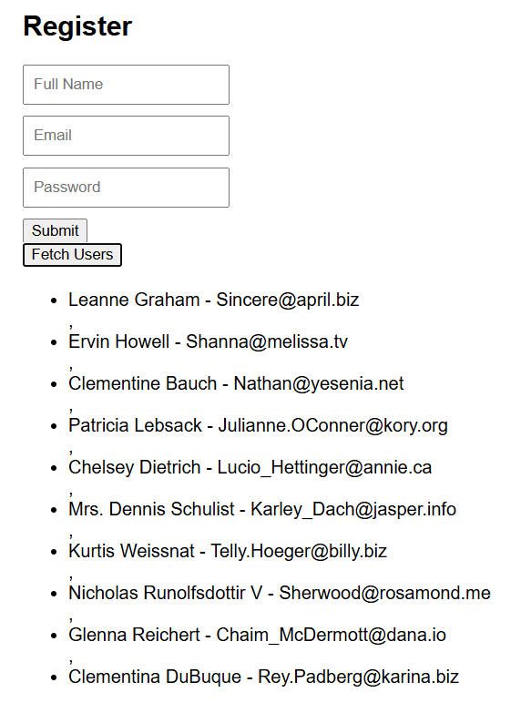

# Enhanced Form Validation

## Overview
This project is a simple web-based registration form with enhanced validation for user inputs. The form includes fields for Full Name, Email, and Password, with real-time validation and error messaging. Additionally, there is a feature to fetch and display a list of users from an external API.

## Features
- Real-time form validation for:
  - Full Name (Required field)
  - Email (Validated using a regex pattern)
  - Password (Must contain at least 8 characters, including uppercase, lowercase, number, and special character)
- Error messages displayed dynamically
- Prevents form submission if validation fails
- Fetches a list of users from an API and displays them

## Technologies Used
- HTML
- CSS
- JavaScript

## Installation
No installation is required. Simply open the `index.html` file in any modern web browser.

## Usage
1. Open the `index.html` file in your browser.
2. Fill in the form fields:
   - Enter your Full Name.
   - Provide a valid Email address.
   - Set a secure Password following the required format.
3. Click the **Submit** button.
   - If validation passes, the form will be submitted.
   - If validation fails, error messages will appear.
4. Click the **Fetch Users** button to retrieve a list of users from an external API.

## Validation Rules
- **Full Name:** Cannot be empty.
- **Email:** Must follow the correct email format (e.g., `example@domain.com`).
- **Password:**
  - At least 8 characters long
  - Must contain at least one uppercase letter
  - Must contain at least one lowercase letter
  - Must contain at least one number
  - Must contain at least one special character (e.g., `@`, `#`, `$`)

## API Used
The user list is fetched from `https://jsonplaceholder.typicode.com/users`.

## Future Improvements
- Implement server-side validation for added security.
- Add password strength indicators.
- Enhance UI with animations and styling improvements.
- Store user data in a database.

## License
This project is open-source and available under the MIT License.

